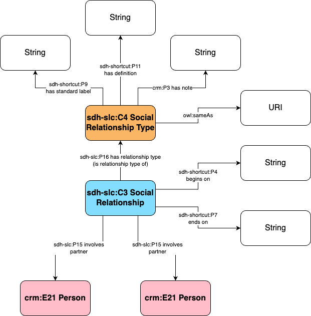

# Information about the `mariage` table

## Data Exploration

Here is the 

| Column Name | Data Type |  Comments |
|-------------|-----------|------|
| sysid | integer | Internal system id, not to reuse |
| id | integer | One of the two ID of the wedding, not to reuse |
| idMariage | character varying | One of the two ID of the wedding, use as the base for the URI creation  |
| idFemme | integer | Links to one of the partners in the Social Relationship |
| idMari | integer | Links to one of the partners in the Social Relationship  |
| anneeMariage_Utilisee | character varying | Begin date (only year) of the social relationship |
| anneeDivorce_Utilisee | character varying | End date (only year) of the social relationship |
| auteurModif | character varying | Internal tracking of edition of data. Not to transform |
| creation | character varying | Internal tracking of edition of data. Not to transform |
| dateExacte_divorce | character varying | Exact date when available. Not to reuse |
| dateExacte_mariage | character varying | Exact date when available. Not to reuse |
| saisie | character varying | Internal tracking of edition of data. Not to transform |
| sources | text | To document if possible |
| debut_EnToutCas | character varying | Dates where the marriage was attested during data collection (1910, 1937, etc.). Not to reuse |
| dureeAffichee | character varying | Dates that are displayed on the website. Not to reuse |
| fin_EnToutCas | character varying | Dates where the marriage was attested during data collection (1910, 1937, etc.). Not to reuse |
| zkp_Mariage | character varying | Another ID of the wedding, not to reuse |
| versionDate | date | Internal tracking of edition of data. Not to transform |

Here is the number of empty cells and number of values in the various date columns:

|column_name|nbr_empty_values|nbr_values|
|-----------|----------------|----------|
|anneeMariage_Utilisee|1385|4246|
|anneeDivorce_Utilisee|4215|1416|
|dateExacte_mariage|5500|131|
|dateExacte_divorce|5562|69|
|debut_EnToutCas|5493|138|
|fin_EnToutCas|5631|0|

This shows that only `anneeMariage_Utilisee` and `anneeDivorce_Utilisee` should be used for the dates of the marriage.

Here is the number of empty cells, number of values and number of distinct values in the `sources` column

|column_name|nbr_empty_values|nbr_values|nbr_distinct_values|
|-----------|----------------|----------|-------------------|
|sources|5610|21|2|

The two values are: "Base Profs Unil www.gen-gen.ch" and "Base Profs Unil".

The SQL queries can be found [here](../database_inspection/person_marriage.sql)

## Data Transformation

The first step in data transformation is correting a URI issue in the data, which is done with a small transformation script in the SQL file [here](../database_inspection/person_marriage.sql).

Another table is created, called `social_relationship_type`, that is manually populated with the instance "marriage". It contains the following columns:
- pk_social_relationship_type (primary kex of the entities)
- name (label of the Social Relationship Type)
- description (brief Social Relationship Type)
- notes (notes about the Social Relationship Type, for the moment empty)
- wikidata_uri (uri of the instances of the Social Relationship Type in wikidata)
- import_notes (notes on how the data was transformed)

One cleaned, a new view of the `mariage` table is created, called `v_marriage`, with:
- The ID the of the marriage, based on the column `idMariage`;
- The column for the ID of the woman, based on the column `idMariage`;
- The column for the ID of the man, , based on the column `idMariage`;
- The foreign key of the Social Relationship Type
- Th 6 dates columns

## Data Mapping

There are 3 different ways to document marriage with the SDHSS ontology ecosystem:
1. With the `crm:E21 Person` linked to the `sdh-slc:C3 Social Relationship` via the generic `sdh-slc:C43 Actor's Role in a Social Relationship`. This allows the documentation of marriages in a same way as other social relationship, keeping therefore some complexity
2. With a more generic `sdh-slc:C3 Social Relationship` linked to the `crm:E21 Person` involved via the property `sdh-slc:P15 involves partner`, without specifying the roles "husband" and "wife". This could be problematic when those roles bears different functions and/or rights
3. With specific class and properties for marriages, as this time of information is central to human relations but also generic for western societies. This means the creation of a `sdh-slc:CX Marriage` class, and the properties `sdh-slc:PX has husband` and `sdh-slc:PX has wife`.

It was decided to follow the option 2 for the data transformation, relying on the generic `sdh-slc:C3 Social Relationship`, typed as "Marriage", without specifying the roles "husband" or "wife", as it is implied in the gender of the person.

The ontological mapping from the table and the SDHSS ontology ecosystem is as follows:
- the marriages are instances of the class [`sdh-slc:C3 Social Relationship`](https://sdhss.org/ontology/social-life-core/C3)
- The column `id` serves as the basis for the URI of the Social Relationship instance
- The column `anneeMariage_Utilisee` is a string linked to the instance of Social Relationship through the property [`sdh-shortcut:P4 begins on`](https://sdhss.org/ontology/shortcuts/P4)
- The column `anneeDivorce_Utilisee` is a string linked to the instance of Social Relationship through the property [`sdh-shortcut:P7 end on`](https://sdhss.org/ontology/shortcuts/P7)
- The instance of Social Relationship is linked to the instance of Social Relationship Type is a string through the property [`sdh-slc:P16 has social relationship type`](https://sdhss.org/ontology/social-life-core/P16)
- the Social Relationship Type are instances of the class [`sdh-slc:C4 Social Relationship Type`](https://sdhss.org/ontology/social-life-core/C4)
- The column `pk_social_relationship_type` serves as the basis for the URI of the Social Relationship Type instance
- The column `name` is a string linked to the instance of Social Relationship Type through the property [`sdh-shortcut:P9 has standard label`](https://sdhss.org/ontology/shortcuts/P9)
- The column `description` is a string linked to the instance of Social Relationship Type through the property [`sdh-shortcut:P11 has definition`](https://sdhss.org/ontology/shortcuts/P11)
- The column `notes` is a string linked to the instance of Social Relationship Type through the property [`crm:P3 has note`](http://www.cidoc-crm.org/cidoc-crm/P3_has_note)
- The column `wikidata_uri` is a string linked to the instance of Social Relationship Type through the property [`owl:sameAs`](https://www.w3.org/TR/2004/REC-owl-semantics-20040210/#owl_sameAs)
