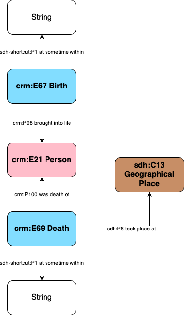

# Information about the birth and death of individuals

## Information analysis

The birth and death of a person is documented in different fields in the `identite` table:

- `naissance`: the birth date, in string
- `mort`: la date de mort
- `lieuNaissance`: the birth place (town), in string
- `cantonNaissance`: the Swiss Canton of the birth place, in string

Each field has its own rules, structures and types of inconsistencies, and are analysed below.

### Birth and Death Dates

#### Data exploration

Dates are documented and strings and do not follow a specific standard. Here are some examples:

| id     | date           |
| ------ | -------------- |
| 79087  | 06.12.1945     |
| 93932  | 1971           |
| 64114  | 1867?          |
| 50200  | 1905 ou 1930 ? |
| 99167  | ??             |
| 111395 | 02/02/1964     |
| 106099 | vers 1960      |
| 98452  | ca. 1870       |

Here is the count of occurences of each birth and death in the table `identite`.

| column name | number of occurences |
| ----------- | -------------------- |
| birth       | 45512                |
| death       | 22725                |

see here the [SQL code](../database_inspection/sh_person_birth-death.sql)

#### Data cleaning

The first step is to clean those date fields. It was decided to only extract the birth year, even if this will reduce a bit the precision of the dates.

The SQL script is documented [here](../database_inspection/sh_person_birth-death.sql)

### Birth Place

As places are not only documented in the identite table, a specific page about geographical places mentioned in all the tables of the Elites Suisses data has been created. It can be found [here](t_geo_place.md).

## Data Transformation

Extract years.

[here](../database_inspection/sh_person_birth-death.sql)

TO DO

Do the same for the death year.

Should we have two processes for the birth (with place and parents) and the death (just the date)?

## Data Mapping

DEVIDE THE BIRTH (WITH TABLE BIRTH/PARENTS) AND DEATH?

The ontological mapping from the table and the SDHSS ontology ecosystem is as follows:

- The new column `birth` is a string linked to the instance of person through the property [`sdh-shortcut:P11 has definition`](https://sdhss.org/ontology/shortcuts/P11)

The ontological diagram:

