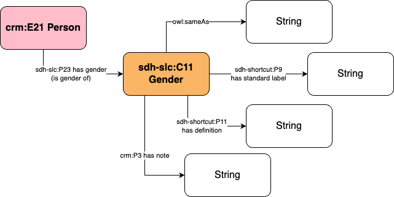

# Information about the Gender of persons

## Exploration

The `identite` table has a column called `sexe`. Containing string values values, it has the following distinct values and their frequency:

|gender|frequency|
|------|--------|
||195|
|F|11216|
|H|47318|

The SQL query can be found [here](../database_inspection/sh_person_gender.sql).

This column contains the information of the gender of individuals. Those string values should be instanciated, which implies the creation of a table gender.

## Data Transformation

The transformation from the sting value to a dedicated table requires:
- the creation of a `gender` table is the elite suisse database, with the columns
    - pk_gender (primary kex of the entities)
    - name (label of the gender)
    - description (brief description of the gender)
    - code (not sure what this is)
    - notes (notes about the gender, for the moment empty)
    - wikidata_uri (uri of the instances of the genders in wikidata)
    - import_notes (notes on how the data was transformed)
- The gender table is then manually documented (as there are only two instances of genders)
- creation of a new `fk_gender` column in the identite table

## Data Mapping

The ontological mapping from the table and the SDHSS ontology ecosystem is as follows:
- the `genders` are instances of the class [`sdh-slc:C11 Gender`](https://sdhss.org/ontology/social-life-core/C11)
- The column `pk_gender` serves as the basis for the URI of the gender instance
- The column `name` is a string linked to the instance of gender through the property [`sdh-shortcut:P9 has standard label`](https://sdhss.org/ontology/shortcuts/P9)
- The column `description` is a string linked to the instance of gender through the property [`sdh-shortcut:P11 has definition`](https://sdhss.org/ontology/shortcuts/P11)
- The column `notes` is a string linked to the instance of gender through the property [`crm:P3 has note`](http://www.cidoc-crm.org/cidoc-crm/P3_has_note)
- The column `wikidata_uri` is a string linked to the instance of gender through the property [`owl:sameAs`](https://www.w3.org/TR/2004/REC-owl-semantics-20040210/#owl_sameAs)

Here is the ontological diagram:

### Ontological Profiles

[Person - Gender light](https://ontome.net/profile/535)

