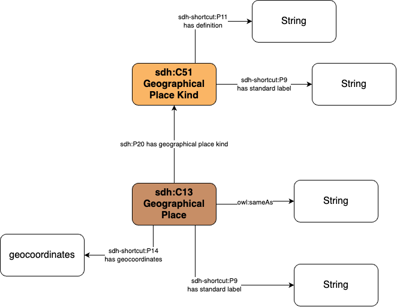

# Information about Geographical Places

This page documents the exploration of the places mentioned in the various tables of the Elites Suisses data.

Places are all documented with a string value, but should be transformed into instances of the class [`sdh:C13 Geographical Place`](https://ontome.net/class/363).

## List of places documented in Elites Suisses

### Relationship between place levels

Three levels of places are documented in the Elites Suisses database:
- Countries
- Swiss Cantons
- Settlements

Each of those levels are related:
- Table `identite`:
    - column `lieuNaissance`
    - column `cantonNaissance`
- Table `education`:
    - column `lieu`
    - column `canton`
    - column `pays`
- Table `entite`:
    - column `siege`
    - column `siegeCanton`
    - column `pays`
    - column `creationLieu`
    - column `creationCanton`

As those places are related (settlements being in a canton, a canton being in a country), documenting the lower level should be sufficient. However, there are some cases where not all three levels ar documented:
- In the `identite` table, there are 317 accounts where the `cantonNaissance` is documented but not the `lieuNaissance`. Inversly, there are 711 cases where a `lieuNaissance` is documented without a `cantonNaissance`.
- In the `education` table, there are 2634 accounts where the `canton` is documented but not the `lieu`.
- In the `education` table, there are 4196 accounts where the `pays` is documented but not the `lieu`.
- In the `entite` table, there are 521 accounts where the `siegeCanton` is documented but not the `siege`.
- In the `entite` table, there are 90 accounts where the `pays` is documented but not the `siege`.
- In the `entite` table, there are 17 accounts where the `creationCanton` is documented but not the `creationLieu`.

see here the [SQL scripts](../database_inspection/t_geo_place_exploration.sql).

Canton relatively simple, as there is only 26 Cantons, already present in the identite_cantonNaissance. The Elites Suisses database uses the two letter code for cantons. Here is the list of value that don't follow this rule:

|identite_cantonnaissance|frequency|
|------------------------|---------|
|etranger|2861|
|be (aujourd'hui ju)|11|
|étranger|7|
|be (aujourd'hui bl)|4|
|berne|2|
|lucerne|2|
|ju (be historique)|1|
|suisse|1|
|tg ou sg|1|
|uri|1|
|bs?|1|
|sz?|1|
|so?|1|

|education_canton|frequency|
|----------------|---------|
|etranger|149|
|vaud|6|
|zurich|1|
|sg + sz|1|
|be (devient ju)|1|
|zürich|1|
|ar + sg|1|
|so ?|1|
|ju (be historique)|1|
|new york|1|
|vaud, zurich
|1|
|be?|1|
|gr + fr|1|
|grisons|1|
|bs et sh|1|

|entite_siegecanton|frequency|
|------------------|---------|
|etranger|2|

|entite_creationcanton|frequency|
|---------------------|---------|
|etranger|2|
|suède|1|
|france|1|
|1905|1|

Based on this information, it has been decided to start documenting the Settlements, and, later on, add the Cantons and Countries for the cases where the Settlement is not documented.

### Settlements

Settlements are documented in four columns:
- Table `identite`: column `lieuNaissance`
- Table `education`: column `lieu`
- Table `entite`: column `siege`
- Table `entite`: column `creationLieu`

Here is the counting of distinct places in each of the columns:

|column_name|number_occurences|
|-----------|-----------------|
|identite_lieuNaissance|3376|
|education_lieu|1039|
|entite_siege|614|
|entite_creationLieu|110|

As the identite_lieuNaissance is the column containing the most distinct values, the other columns has been compared to count values that are NOT present in the identite_lieuNaissance columns.

|column_name|missing_from_lieunaissance|
|-----------|--------------------------|
|education_lieu|640|
|entite_siege|321|
|entite_creationLieu|19|

see here the [SQL scripts](../database_inspection/t_geo_place_exploration.sql).

This means that if the column identite_lieuNaissance is transformed into instances of the class `sdh:C13 Geographical Place`, it will not contain all of the places documented in the Elites Suisses database.

It was decided to first work on the identite_lieuNaissance columns, and work on the other places later on.

For the `lieuNaissance`, there are 3376 distinct values, if we trim spaces and have only lowercase, and not counting empty values.

Here is the list of the 10 most frequent values:

|birth_place|effectif|
|-----------|--------|
|genève|930|
|zurich|849|
|bâle|790|
|lausanne|732|
|berne|492|
|neuchâtel|204|
|zürich|185|
|lugano|182|
|lucerne|181|
|la chaux-de-fonds|151|

see here the [SQL scripts](../database_inspection/t_geo_place_exploration.sql).

## Data Cleaning and reconcliation in OpenRefine

The cleaning of the places fields (both Canton and Places) required:
- The cleaning of the string value, to avoid duplicates
- The creation of instances for each place, so that they can be documented further and receive a unique identifier
- Reconcile the places with equivalent instances in Wikidata

This how the data has been processed: 

1. First the data was cleaned/regularized with openrefine in the identite table, duplicating the fields (to keep the original value) then cleaning and removing duplicates (such as "Zurich" and "Zürich"), and turned into the file "birth-places-citizenship-military-grades-new-cleaned.csv".
2. Then CSV is then transformed into multiple table, in a new person.db SQL database, using the main.py script. 
3. The rank, birth place, and citizenship tables are then extracted using the export sql-script to a series of csvs with the same names.
4. The table csvs are then imported into OpenRefine to do the final wikidata reconciliation, and later re inserted into the database using the import sql-script.

## New tables relating to geographical places

In the elites suisses SQL database, a new table, called `t_geo_place` has be created, based on the table `birth_place` in the `person.db` SQL database in the folder entities_matching. In addition, a table `t_geo_place_kind` was created (with the column `pk_place_kind`, `name`, `definition`), with manualy entering the instance for "Settlement" and "Legal Territory".

A new table `t_person_place` associates a person (table `identite`) with a place and provides a relation type in order to specify if it is a birth place, activity place, death place, etc.

A new table `t_geo_relation` has been created, associating two geographical place to provide a relationship type, such as a place being within another place, etc. This table should be documented manually, and is for the moment empty.

## Mapping

The ontological mapping from the table and the SDHSS ontology ecosystem is as follows:
- the settlements are instances of the class [`sdh:C13 Geograpical Place`](https://sdhss.org/ontology/core/C13)
- The column `pk_place` serves as the basis for the URI of the geographical place instance
- The column `name` is a string linked to the instance of geographical place through the property [`sdh-shortcut:P9 has standard label`](https://sdhss.org/ontology/shortcuts/P9)
- The column `wikidata_uri` is a string linked to the instance of geographical place through the property [`owl:sameAs`](https://www.w3.org/TR/2004/REC-owl-semantics-20040210/#owl_sameAs)
- The column `geocoordinates` is a string linked to the instance of geographical place through the property [`sdh-shortcut:P14 has geocoordinates`](https://sdhss.org/ontology/shortcuts/P14)
- the geographical place kind are instances of the class [`sdh:C51 Geograpical Place Kind`](https://sdhss.org/ontology/core/C51)
- The column `name` is a string linked to the instance of geographical place kind through the property [`sdh-shortcut:P9 has standard label`](https://sdhss.org/ontology/shortcuts/P9)
- The column definition is a string linked to the instance of geographical place kind through the property [`sdh-shortcut:P11 has definition`](https://sdhss.org/ontology/shortcuts/P11)

Here is the ontological diagram:

### Ontological Profiles

- [Geographical Place - Type](https://ontome.net/profile/588)
- [Geographical Place - Geocoordinates light](https://ontome.net/profile/607)