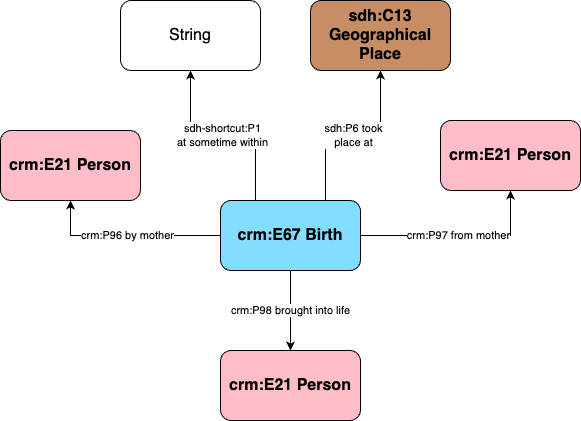

# Information about the new `v_person_birth` table.

## Table creation

As the documentation of parents in the SDHSS ontology ecosystem is done through the birth event, a new view called `v_person_birth` is created, which contains information mostly from the `filiation` table as well as the `identite` table:
- an identifier which is the concatenation of the two `idFiliation` values (mother and father)
- a new identifier for the birth, based on the child id
- the birth year, based on the new column `birth_year` of the `identite` table (see [here](../information_analysis/person_birth-death.md))
- the foreign key of the child
- the foreign keys of the mother and father

The SQL queries are documented [here](../database_inspection/filiations.sql). See also the [filiation page](../information_analysis/filiations.md)

In addition, we need to add in this view the birth place. Based on what is described in the [`t_geo_place`](../information_analysis/t_geo_place.md) page, a new `t_geo_place` table has been created, and a link between the person and the birth place has been added in the `identite` table. The new `v_person_birth` view also this fk of the place as a `birth_place` column

First 20 lignes of the view:

A REFAIRE

## Data Mapping

The ontological mapping from the table and the SDHSS ontology ecosystem is as follows:
- the births are instances of the class [`crm:E67 Birth`](http://www.cidoc-crm.org/cidoc-crm/E67_Birth)
- The column `child` is the ID of the person linked to the instance of birth through the property [`crm:P98 brought into life`](http://www.cidoc-crm.org/cidoc-crm/P98_brought_into_life)
- The column `mother` is the ID of the person linked to the instance of birth through the property [`crm:P96 by mother`](http://www.cidoc-crm.org/cidoc-crm/P96_by_mother)
- The column `father` is the ID of the person linked to the instance of birth through the property [`crm:P97 from father`](http://www.cidoc-crm.org/cidoc-crm/P97_from_father)
- Birth dates
- Birth place

The ontological diagram:

### Ontological Profiles

[Person - Familiy light](https://ontome.net/profile/601)
[Person - Birth and Death](https://ontome.net/profile/510)
